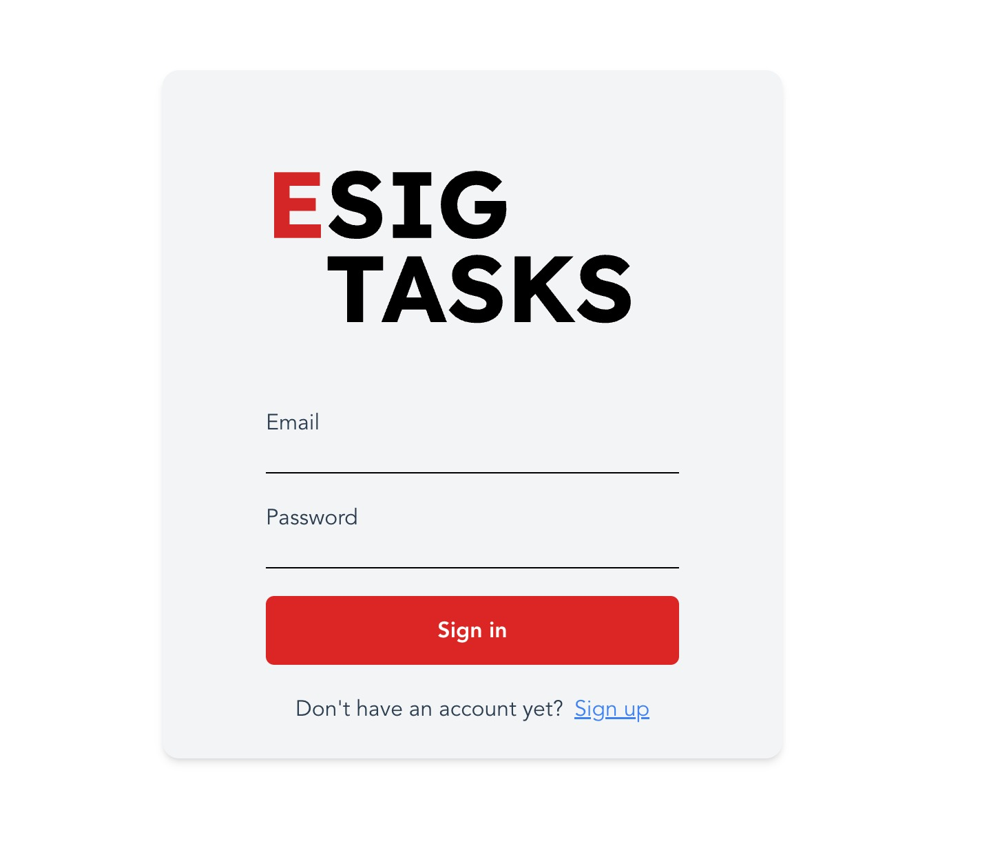
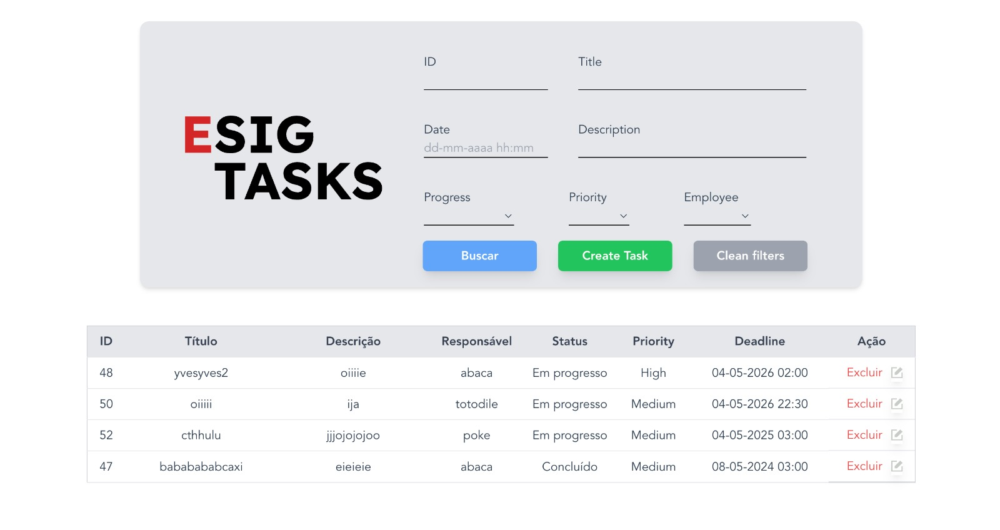

# esig-tarefa-vue

# EsigTaskFrontEnd - Vue.js com Tailwind CSS

# AVISO
Para uso completo não esqueça de acessar a Api disponível em [EsigTaskApi](https://github.com/Erigeo/EsigTarefaGerenciador) e seguir os passos descritos.

#Imagens




## Descrição
Este projeto é um frontend desenvolvido em **Vue.js** e estilizado com **Tailwind CSS**. Ele foi criado com base no que foi proposto na tarefa de estágio fullstack da Esig Group. O projeto permite que os usuários manipulem a interface desenvolvida para interagir com a API. Assim, sendo possível criar conta, ser autenticado, e realizar CRUD de Tasks.

## Tecnologias Utilizadas
- **Vue.js** 
- **Tailwind CSS** 
- **Node.js** 

## Pré-requisitos
Antes de começar, certifique-se de ter as seguintes ferramentas instaladas em sua máquina:
- [Node.js](https://nodejs.org/) (versão x.x.x ou superior)
- [Vue CLI](https://cli.vuejs.org/) ou [Vite](https://vitejs.dev/) (dependendo de como o projeto foi iniciado)

## Instalação
Siga as etapas abaixo para configurar e rodar o projeto localmente.

1. Clone o repositório para sua máquina local:
    ```bash
    git clone https://github.com/Erigeo/EsigTasksFront
    ```

2. Navegue até o diretório do projeto:
    ```bash
    cd esig-tarefa-vue
    ```

3. Instale as dependências do projeto:
    ```bash
    npm install
    ```

4. Execute o servidor de desenvolvimento:
    ```bash
    npm run dev
    ```

5. O projeto estará disponível no navegador no endereço: `http://localhost:8080` (ou outra porta, dependendo da sua configuração).

6. Averiguar em qual endereço estará rodando sua Api, caso esteja diferente do utilizado no projeto. Acessa o Service -> Api e altere o endereço inserido.

7. Link da Api: [EsigTaskApi](https://github.com/Erigeo/EsigTarefaGerenciador)
